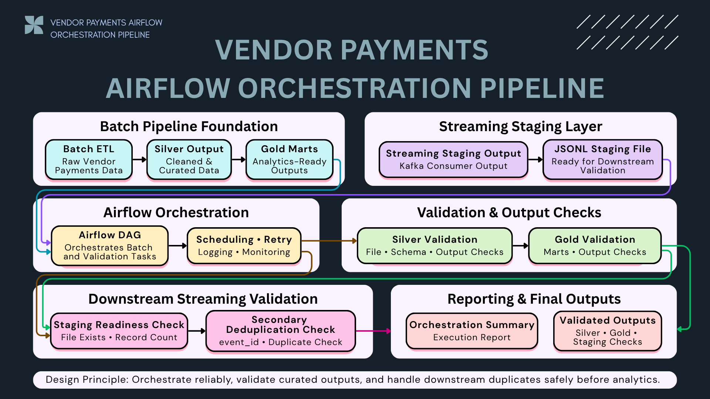
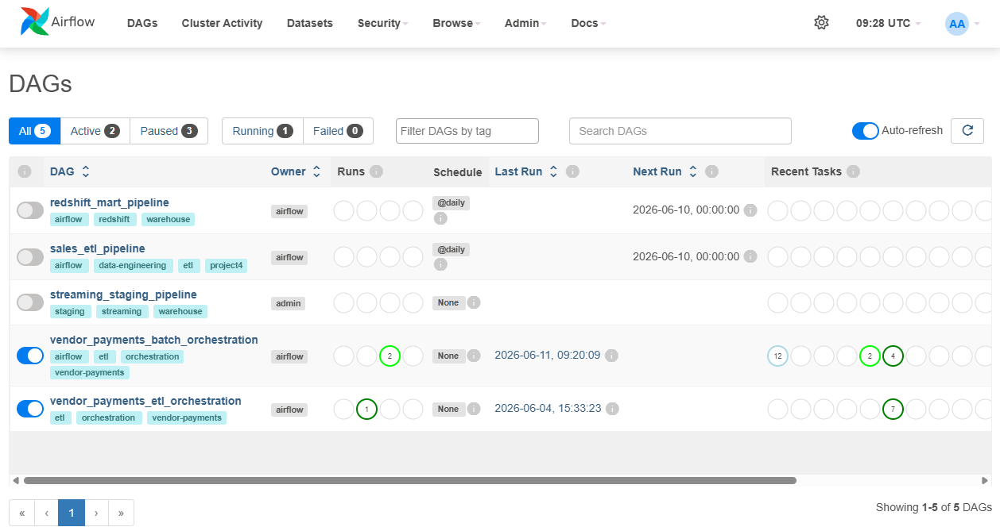
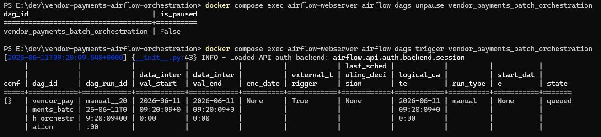
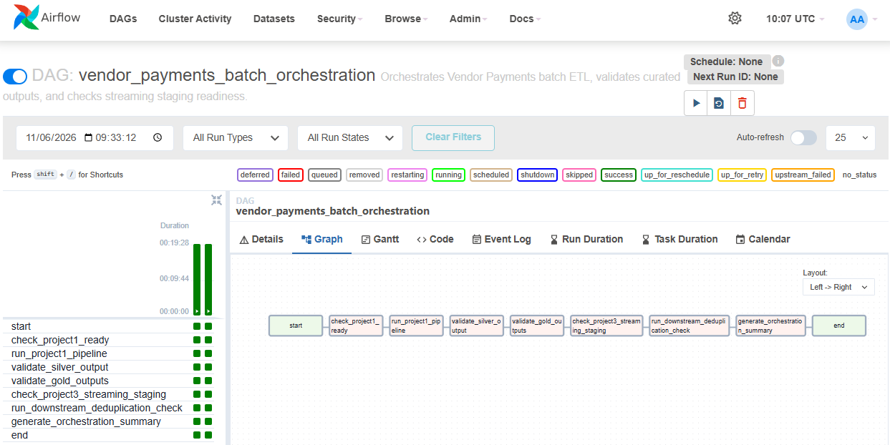
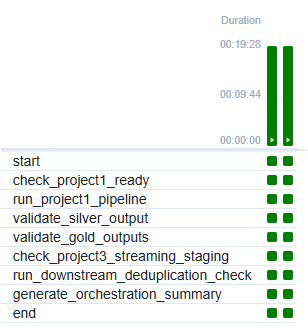
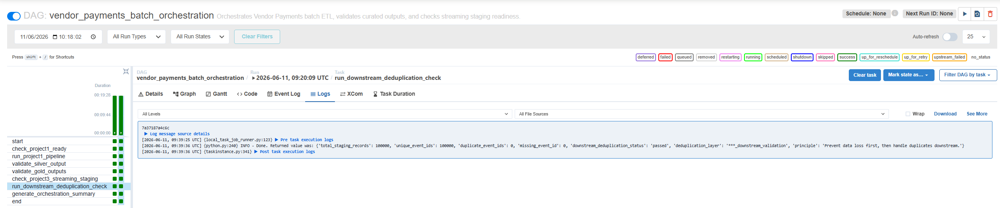
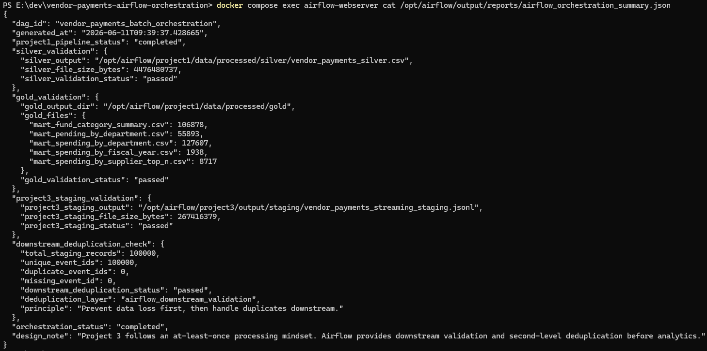
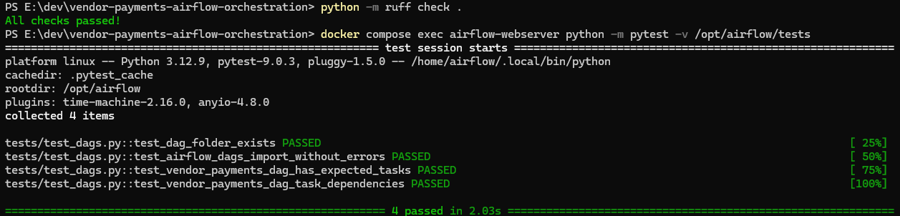

# 🛠 Vendor Payments Airflow Orchestration


---

## 📌 Summary

This project uses **Apache Airflow** as the orchestration layer for the Vendor Payments data platform.

The main goal is to prove that the Vendor Payments pipeline is not only executable manually, but can also be:

* orchestrated
* monitored
* retried
* validated
* prepared for downstream analytics

Airflow orchestrates the Project 1 batch ETL pipeline, validates generated Silver and Gold outputs, checks Project 3 streaming staging output, runs downstream deduplication validation, and writes an orchestration summary report.

---

## 🧭 Architecture Overview



This orchestration project connects two parts of the Vendor Payments platform:

* **Batch Pipeline Foundation**
  Runs the batch ETL pipeline and validates Silver / Gold outputs.

* **Streaming Staging Layer**
  Checks the JSONL staging output generated by the Kafka streaming pipeline.

Airflow does not rerun Kafka producer or consumer jobs in this project.
Instead, it treats the streaming staging file as a downstream input for validation and duplicate checking.

**Design principle:**
Orchestrate reliably, validate curated outputs, and handle downstream duplicates safely before analytics.

---

## 🔗 Project Integration

This project connects with the broader Vendor Payments data platform:

| Project   | Role                                                               |
| --------- | ------------------------------------------------------------------ |
| Project 1 | Batch ETL foundation that produces Silver and Gold outputs         |
| Project 3 | Kafka streaming pipeline that writes JSONL staging output          |
| Project 4 | Airflow orchestration, validation, and downstream deduplication    |
| Project 5 | Cloud / S3 / Athena layer for publishing curated analytics outputs |

The batch pipeline originally followed this path:

```text
Project 1 → Project 4 → Project 5
```

After completing the streaming pipeline, Project 4 was extended to include downstream validation for Project 3 staging data:

```text
Project 3 Streaming Output → Project 4 Downstream Validation
```

---

## ⚙️ DAG Structure

Main DAG:

```text
vendor_payments_batch_orchestration
```

DAG file:

```text
dags/vendor_payments_etl_orchestration.py
```

Main task flow:

```text
start
  → check_project1_ready
  → run_project1_pipeline
  → validate_silver_output
  → validate_gold_outputs
  → check_project3_streaming_staging
  → run_downstream_deduplication_check
  → generate_orchestration_summary
  → end
```

---

## 🧩 What Each Task Does

### 1. `check_project1_ready`

Checks that the Project 1 repository is mounted correctly inside the Airflow container and that the main pipeline script exists.

Expected Project 1 path inside Airflow:

```text
/opt/airflow/project1
```

Expected pipeline script:

```text
/opt/airflow/project1/scripts/pipeline/run_pipeline.py
```

---

### 2. `run_project1_pipeline`

Runs the Project 1 batch ETL pipeline from Airflow:

```text
python -m scripts.pipeline.run_pipeline
```

This step rebuilds the Vendor Payments Silver and Gold outputs.

---

### 3. `validate_silver_output`

Validates that the Silver output exists and is not empty:

```text
/opt/airflow/project1/data/processed/silver/vendor_payments_silver.csv
```

Validation checks:

* file exists
* file size > 0
* output is ready for downstream processing

---

### 4. `validate_gold_outputs`

Validates that Gold marts were generated successfully.

Expected Gold output directory:

```text
/opt/airflow/project1/data/processed/gold
```

Validated marts include:

```text
mart_fund_category_summary.csv
mart_pending_by_department.csv
mart_spending_by_department.csv
mart_spending_by_fiscal_year.csv
mart_spending_by_supplier_top_n.csv
```

---

### 5. `check_project3_streaming_staging`

Checks that the Project 3 streaming staging output exists and contains data.

Expected Project 3 staging file:

```text
/opt/airflow/project3/output/staging/vendor_payments_streaming_staging.jsonl
```

This file is produced by the Kafka streaming pipeline and used as downstream input for Airflow validation.

---

### 6. `run_downstream_deduplication_check`

Reads the Project 3 JSONL staging file and performs a downstream duplicate check.

The task validates:

* total staging records
* unique `event_id` count
* duplicate `event_id` count
* missing `event_id` count

Final validated result from the controlled run:

```text
total_staging_records = 100000
unique_event_ids = 100000
duplicate_event_ids = 0
missing_event_id = 0
downstream_deduplication_status = passed
```

---

### 7. `generate_orchestration_summary`

Generates an orchestration summary report:

```text
/opt/airflow/output/reports/airflow_orchestration_summary.json
```

The report includes:

* Project 1 pipeline status
* Silver validation result
* Gold validation result
* Project 3 staging validation result
* Downstream deduplication result
* Overall orchestration status

Runtime reports are ignored by Git because they are generated outputs.

---

## 🔁 Downstream Deduplication Strategy

Project 3 follows an **at-least-once processing mindset**.

The streaming pipeline prioritizes durable staging output before offset commit:

```text
read event
→ validate event
→ check duplicate
→ write staging output
→ mark Redis as processed
→ commit Kafka offset
```

This design prioritizes:

```text
Prevent data loss first.
Handle duplicates safely downstream.
```

Project 4 provides the downstream validation layer.

Airflow checks the staged JSONL output and performs a second-level deduplication check using `event_id`.

This ensures that even if replayed or duplicate events appear in downstream staging data, they can be detected before analytics outputs are trusted.

---

## 🐳 Docker Mounts

Project 1 and Project 3 are mounted into the Airflow container so the DAG can orchestrate and validate both projects.

Example Docker paths:

```text
/opt/airflow/project1
/opt/airflow/project3
/opt/airflow/output
```

The Airflow DAG uses Docker-compatible Linux paths instead of Windows paths.

---

## ▶️ How to Run Locally

Start Airflow services:

```powershell
docker compose up -d
```

Check services:

```powershell
docker compose ps
```

Open Airflow UI:

```text
http://localhost:8080
```

Trigger DAG from CLI:

```powershell
docker compose exec airflow-webserver airflow dags unpause vendor_payments_batch_orchestration
docker compose exec airflow-webserver airflow dags trigger vendor_payments_batch_orchestration
```

Check DAG runs:

```powershell
docker compose exec airflow-webserver airflow dags list-runs -d vendor_payments_batch_orchestration
```

---

## ✅ Testing

Run Ruff locally:

```powershell
python -m ruff check .
```

Run Airflow DAG tests inside the Airflow container:

```powershell
docker compose exec airflow-webserver python -m pytest -v /opt/airflow/tests
```

Why tests run inside the container:

Airflow dependencies are installed in the Docker image, so DAG import tests should run in the same environment used by the Airflow webserver and scheduler.

Validated tests:

```text
test_dag_folder_exists
test_airflow_dags_import_without_errors
test_vendor_payments_dag_has_expected_tasks
test_vendor_payments_dag_task_dependencies
```

---

## 📸 Evidence

### 1. Airflow Orchestration Architecture


---

### 2. Airflow DAG List



---

### 3. DAG Triggered from CLI



---

### 4. DAG Graph View



---

### 5. Successful Run Grid



---

### 6. Downstream Deduplication Task Logs



---

### 7. Orchestration Summary Report



---

### 8. Ruff and Pytest Passed



---

## 🗂 Earlier Batch Orchestration Evidence

Before extending this project with streaming staging validation and downstream deduplication checks, the Airflow orchestration layer first validated the batch pipeline foundation.

Earlier batch orchestration screenshots are stored in:

```text
assets/vendor-payments-orchestration/batch-foundation/
```

This keeps the project history while making the latest orchestration flow clear in the main README.

---

## 🧠 What This Project Demonstrates

This project demonstrates practical data engineering orchestration skills:

* Building Airflow DAGs for production-style workflows
* Triggering an existing batch ETL project from Airflow
* Validating Silver and Gold outputs after pipeline execution
* Checking streaming staging data as downstream input
* Applying second-level duplicate validation after Kafka ingestion
* Generating an orchestration summary report
* Running DAG integrity tests in an Airflow container
* Managing evidence and project history cleanly

---

## 💡 Key Takeaway

A data pipeline should not only run manually.

It should be orchestrated, monitored, retried, and validated.

This project shows how Airflow can act as the orchestration layer between batch ETL outputs and streaming staging data, while enforcing downstream validation before analytics.
