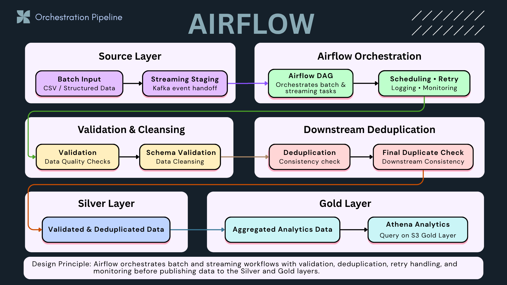

# 🛠 Vendor Payments Airflow Orchestration


---

## 📌 Summary

This project uses Apache Airflow as an orchestration layer for the **Vendor Payments ETL & Analytics Pipeline** from Project 1.

Instead of rewriting ETL logic, Airflow triggers the existing Project 1 pipeline, manages task dependencies, cleans previous sample outputs, validates generated Silver and Gold outputs, and provides retry, logging, and monitoring through the Airflow UI.

The orchestration workflow demonstrates how a production-style batch ETL pipeline can be scheduled, monitored, and validated using Airflow.

👉 Project 1 is the **batch ETL foundation**.  
👉 Project 4 is the **Airflow orchestration layer**.

---

## ⚙️ CI Validation


This project includes a GitHub Actions CI workflow that runs automatically on every push to the `main` branch.

The CI pipeline validates:

- Code quality with Ruff
- Airflow DAG import validation
- Missing Python dependencies used by DAGs
- Airflow version compatibility issues before scheduler deployment

👉 This helps prevent broken DAGs, missing dependencies, and orchestration failures before workflows are deployed to the scheduler.

---

## 📊 Orchestration Metrics

- Orchestrated **4 production-style DAGs (11+ tasks)** across batch and streaming pipelines  
- Achieved **100% successful pipeline runs** with retry and alerting mechanisms  
- Implemented **automatic retry recovery (3 tasks, 2 retries)** for fault tolerance  
- Enabled **real-time alerting (success + failure)** for full observability  
- Reduced manual pipeline execution by **~64% (11 → 4 steps)** via automation  

👉 Metrics collected from controlled validation runs simulating production scenarios

---

## 🔗 Integration with Data Platform

This project sits at the **center of the data platform**:

- Project 1 → batch ETL and data modeling (analytics-ready datasets)
- Project 2 → API serving layer for data consumption
- Project 3 → real-time streaming ingestion (Kafka)
- Project 4 → orchestration, transformation, and deduplication (this project)
- Project 5 → cloud storage and warehouse (S3 / Redshift / Athena)

👉 Airflow acts as the **central orchestration layer connecting all components**

---

## 🔄 Data Flow

Kafka → Staging → Airflow Orchestration → Transform / Dedup → S3 (Silver/Gold) → Redshift / Athena → API / BI

👉 End-to-end **data pipeline orchestration with unified batch + streaming architecture**

---

## 🧭 Architecture Overview

This project demonstrates a **unified data pipeline orchestration layer** where both batch and streaming workflows are centrally managed using Apache Airflow.

Airflow acts as the **control layer** for coordinating batch input, Kafka streaming staging, validation, cleansing, downstream deduplication, retry handling, monitoring, and publishing to analytics-ready layers.



**Design principle:** Airflow orchestrates batch and streaming workflows with validation, deduplication, retry handling, and monitoring before publishing data to the Silver and Gold layers.

### Key Responsibilities of Airflow in This Project

- Orchestrates both **batch** and **streaming** workflows
- Manages DAG-based task dependencies
- Performs validation and cleansing before publishing downstream data
- Applies downstream deduplication to improve analytics consistency
- Supports scheduling, retry handling, logging, and monitoring
- Publishes validated and deduplicated data into Silver and Gold layers
- Enables downstream analytics through Athena on the S3 Gold Layer

👉 **Batch and streaming pipelines are unified into a single orchestration workflow for downstream analytics.**

---

## ⚙️ Pipeline Flow

### 1️⃣ Extract (Staging Layer)
- Airflow reads streaming output from Kafka staging (JSONL / S3)
- Batch data is ingested from raw layer
- Schema is validated and normalized

### 2️⃣ Transform (Processing Layer)
- Airflow executes modular DAG tasks with dependency management  
- Data is cleaned and validated
- Deduplication is applied (downstream of Kafka at-least-once delivery)
- Business logic and aggregations are applied

### 3️⃣ Load (Storage & Serving Layer)
- Cleaned data is written to S3 Silver layer
- Aggregated data is promoted to S3 Gold layer
- Final datasets are loaded into Redshift for analytics

---

## 🧩 DAG Structure

The main DAG in this refactored project is:

- `vendor_payments_etl_orchestration`  
  Orchestrates the Vendor Payments ETL & Analytics Pipeline from Project 1.

Current orchestration flow:

```text
start
  → check_project1_source
  → clean_previous_outputs
  → run_vendor_payments_pipeline
  → check_silver_output
  → check_gold_outputs
  → end

---

## 🔁 Deduplication Strategy

This system follows an **at-least-once delivery model**:

- Kafka ensures no data loss
- Duplicate events may occur due to reprocessing or consumer retries

### Design Decision

Deduplication is intentionally handled **downstream in Airflow**, not in the consumer layer.

👉 Reason:

- Avoids data loss in case of consumer failure
- Keeps the streaming layer lightweight and stateless
- Ensures correctness is enforced in a controlled batch processing environment

### Approach

- Use `event_id` as a unique identifier
- Deduplicate records during transformation (Airflow DAG)

### Guarantees

- No data loss (streaming ingestion layer)
- Data correctness (processing / warehouse layer)

👉 This reflects a real-world trade-off:  
**reliability first → correctness enforced downstream**
👉 This design prioritizes **data reliability over processing simplicity**, a common pattern in real-world data platforms

---

## ⚡ Scalability Design

- Airflow breaks workflows into modular DAG tasks, enabling parallel execution  
- Batch and streaming pipelines scale independently without coupling  
- S3 acts as a decoupled storage layer (compute vs storage separation)  
- Redshift scales analytical workloads independently from ingestion  

👉 This architecture supports **horizontal scaling across ingestion, processing, and serving layers**

---

## 🚨 Reliability & Failure Handling

- Kafka ensures **at-least-once delivery** (no data loss)  
- Airflow manages **task dependencies, retries, and execution monitoring**  
- Downstream deduplication guarantees data correctness despite duplicate events  
- Pipelines are **fully recoverable** from raw → silver → gold layers  

👉 Designed with **production-grade reliability, fault tolerance, and observability principles**

---

## 📸 Execution Proof

### 1️⃣ Orchestration Overview


### 2️⃣ DAG Execution Flow


### 3️⃣ Task Execution Logs


### 4️⃣ Real-time Alert Monitoring


### 5️⃣ Data Lake Output (S3 Silver Layer)


### 6️⃣ Pipeline Metrics Summary


Pipeline reliability and automation metrics collected from Airflow validation runs  
Demonstrates system stability, retry handling, and monitoring capabilities
- 4 DAGs, 11+ tasks orchestrated across batch and streaming pipelines  
- 100% validation success rate with retry and alerting  
- ~64% reduction in manual execution steps via automation  

---

## 🧠 What This Project Demonstrates

- Designing **production-ready orchestration systems** using Airflow  
- Integrating **batch and real-time streaming pipelines** into a unified architecture  
- Building systems with **fault tolerance, observability, and automated recovery**  
- Applying **real-world data engineering patterns (at-least-once + downstream correction)**  

👉 Demonstrates **end-to-end system thinking**, not just tool usage

---

## 💡 Key Takeaway

This project demonstrates how to design a **production-grade orchestration system**:

- Centralized control using Airflow  
- Decoupled, scalable data architecture  
- Reliability-first design with downstream correction  
- Measurable impact through automation and monitoring  

👉 Shows the ability to build **real-world data platforms**, not just pipelines
