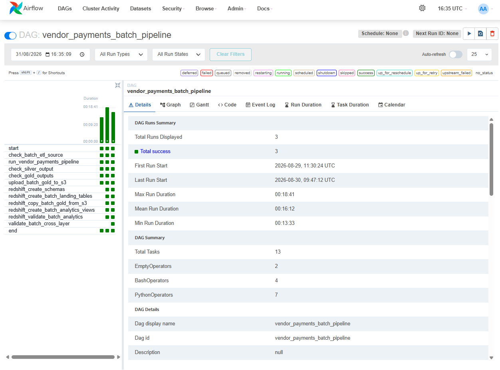
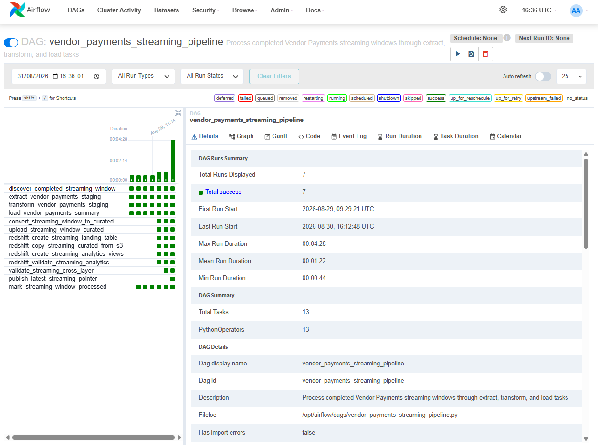
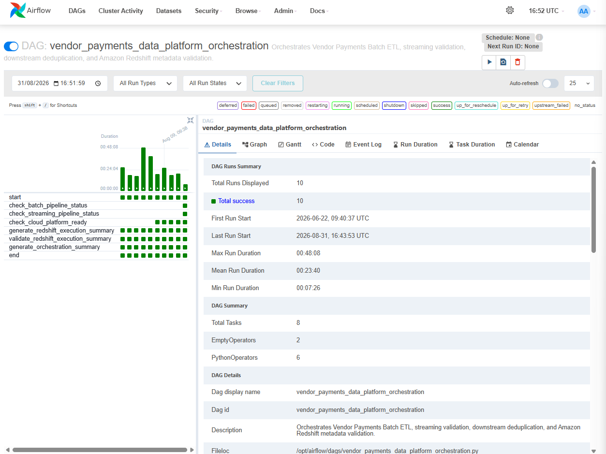
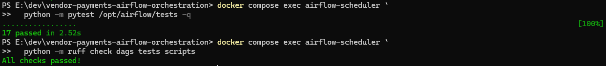
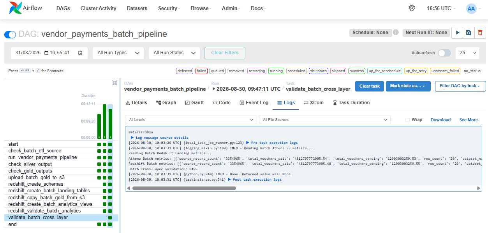
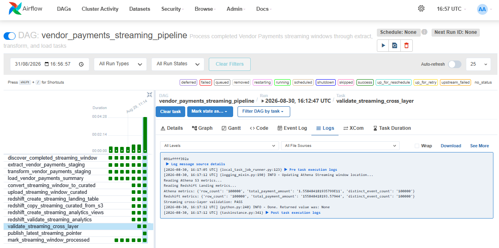
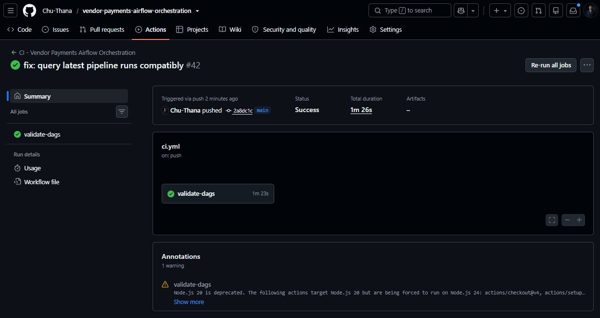
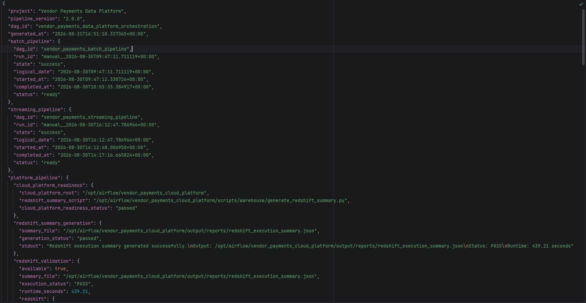

# 🛠 Vendor Payments Airflow Orchestration


Apache Airflow orchestration layer for the Vendor Payments data platform.

The current architecture separates **Batch**, **Streaming**, and **Platform-level coordination** into three focused DAGs. Batch and Streaming execute independently and publish their own outputs. The Main Platform DAG does not rerun either pipeline; instead, it checks their latest successful Airflow run states and then performs platform readiness checks, Redshift metadata validation, and final orchestration reporting.

---

## 📌 Project Summary

The current version replaces the previous single large cross-platform DAG with three independent orchestration lifecycles:

```text
vendor_payments_batch_pipeline
vendor_payments_streaming_pipeline
vendor_payments_data_platform_orchestration
```

This separation allows Batch and Streaming workloads to keep different processing lifecycles while preserving a platform-level coordination layer.

Airflow is responsible for:

* Running and validating the full Batch ETL lifecycle
* Publishing validated Batch Gold data to Amazon S3
* Loading Batch data into Amazon Redshift
* Validating Batch analytics outputs
* Running Athena ↔ Redshift Batch cross-layer validation
* Discovering completed Streaming windows using `_SUCCESS`
* Ignoring windows already marked `_PROCESSED`
* Processing one completed bounded Streaming window at a time
* Publishing per-window curated Streaming data to S3
* Loading Streaming data into Redshift
* Validating Streaming analytics outputs
* Running Athena ↔ Redshift Streaming cross-layer validation
* Publishing `latest.json`
* Creating `_PROCESSED` after downstream Streaming completion
* Checking latest Batch and Streaming DAG run states
* Checking cloud-platform readiness
* Generating and validating Redshift execution metadata
* Generating a final machine-readable orchestration summary
* Providing observable execution through the Airflow UI
* Enforcing automated tests, Ruff linting, and GitHub Actions CI

The core design principle is:

```text
Batch and Streaming own their processing lifecycles.
The Main DAG owns platform-level coordination and reporting.
```

---

## 🧭 Architecture


```text
Batch Pipeline DAG ───────┐
                          ├──→ Pipeline Status Checks
Streaming Pipeline DAG ───┘
                                  ↓
                         Platform Orchestration
```

### Control Flow vs Data Flow

The three DAGs are connected through **Airflow run state**, not by passing Batch or Streaming datasets directly into the Main DAG.

```text
DATA FLOW

Batch DAG
→ S3
→ Redshift
→ Athena validation

Streaming DAG
→ S3
→ Redshift
→ Athena validation
→ latest.json
→ _PROCESSED


CONTROL FLOW

Latest Batch DAG run state ───────┐
                                  ├──→ Main Platform DAG
Latest Streaming DAG run state ───┘
```

The Main Platform DAG queries Airflow metadata to verify that the latest Batch and Streaming runs are successful before continuing with platform-level checks and reporting.

---

## 📊 Current DAG Metrics

| DAG | Tasks | Latest Verified Result |
| --- | ---: | --- |
| `vendor_payments_batch_pipeline` | 13 | Success |
| `vendor_payments_streaming_pipeline` | 13 | Success |
| `vendor_payments_data_platform_orchestration` | 8 | Success |
| **Total across 3 DAGs** | **34** | **Validated** |

Additional validation:

| Metric | Result |
| --- | --- |
| Automated tests | 17 passed |
| Ruff linting | PASS |
| Batch Athena ↔ Redshift validation | PASS |
| Streaming Athena ↔ Redshift validation | PASS |
| Main Platform DAG | Success |
| GitHub Actions CI | Success |

---

## ⚙️ DAG Overview

The repository contains three active DAGs:

```text
vendor_payments_batch_pipeline
vendor_payments_streaming_pipeline
vendor_payments_data_platform_orchestration
```


They use `schedule=None` in the current portfolio environment and are triggered manually for reproducible validation.

---

## 🟦 Batch Pipeline DAG

DAG ID:

```text
vendor_payments_batch_pipeline
```

The Batch DAG owns the full Batch lifecycle:

```text
start
→ check_batch_etl_source
→ run_vendor_payments_pipeline
→ check_silver_output
→ check_gold_outputs
→ upload_batch_gold_to_s3
→ redshift_create_schemas
→ redshift_create_batch_landing_tables
→ redshift_copy_batch_gold_from_s3
→ redshift_create_batch_analytics_views
→ redshift_validate_batch_analytics
→ validate_batch_cross_layer
→ end
```

Responsibilities:

* Run the upstream Vendor Payments ETL pipeline
* Validate Silver and Gold outputs
* Publish validated Gold marts to S3
* Create Redshift schemas and Batch landing tables
* Load Batch data from S3 into Redshift
* Create Batch analytics views
* Validate Redshift Batch analytics
* Compare Batch metrics between Athena and Redshift

Latest verified result:

```text
Tasks: 13
Status: success
Cross-layer validation: PASS
```



---

## 🟪 Streaming Pipeline DAG

DAG ID:

```text
vendor_payments_streaming_pipeline
```

The Streaming DAG processes one completed bounded Streaming window.

```text
discover_completed_streaming_window
→ extract_vendor_payments_staging
→ transform_vendor_payments_staging
→ load_vendor_payments_summary
→ convert_streaming_window_to_curated
→ upload_streaming_window_curated
→ redshift_create_streaming_landing_table
→ redshift_copy_streaming_curated_from_s3
→ redshift_create_streaming_analytics_views
→ redshift_validate_streaming_analytics
→ validate_streaming_cross_layer
→ publish_latest_streaming_pointer
→ mark_streaming_window_processed
```

Window discovery condition:

```text
has _SUCCESS
and
does not have _PROCESSED
```

Responsibilities:

* Discover one completed Streaming window
* Extract staged events
* Transform the bounded window into curated output
* Publish per-window curated data to S3
* Load the selected window into Redshift
* Create and validate Streaming analytics views
* Compare Athena and Redshift metrics
* Publish `latest.json`
* Create `_PROCESSED`

Latest verified result:

```text
Tasks: 13
Status: success
Cross-layer validation: PASS
```



---

## 🟧 Platform Orchestration DAG

DAG ID:

```text
vendor_payments_data_platform_orchestration
```

The Main Platform DAG does **not** rerun Batch or Streaming processing.

Its current flow is:

```text
start
├── check_batch_pipeline_status
└── check_streaming_pipeline_status
        ↓
check_cloud_platform_ready
        ↓
generate_redshift_execution_summary
        ↓
validate_redshift_execution_summary
        ↓
generate_orchestration_summary
        ↓
end
```

### Pipeline Status Checks

`check_batch_pipeline_status` verifies the latest run of:

```text
vendor_payments_batch_pipeline
```

`check_streaming_pipeline_status` verifies the latest run of:

```text
vendor_payments_streaming_pipeline
```

Both checks use Airflow metadata and require the latest upstream run state to be:

```text
success
```

### Platform-Level Tasks

`check_cloud_platform_ready`
verifies that required Cloud Data Platform resources are available.

`generate_redshift_execution_summary`
generates Redshift execution metadata.

`validate_redshift_execution_summary`
validates the generated Redshift summary.

`generate_orchestration_summary`
combines Batch status, Streaming status, cloud readiness, Redshift execution metadata, and final orchestration state.

Latest verified Main DAG run:

```text
Tasks: 8
Status: success
Latest verified start: 2026-08-31 16:43:53 UTC
```



---

## ✅ Automated Testing and Code Quality

Run tests inside the Airflow scheduler container:

```powershell
docker compose exec airflow-scheduler `
  python -m pytest /opt/airflow/tests -q
```

Run Ruff:

```powershell
docker compose exec airflow-scheduler `
  python -m ruff check dags tests scripts
```

Current result:

```text
17 passed
All checks passed!
```



---

## 🔎 Cross-Layer Validation

The current architecture adds independent reconciliation between the S3 Data Lake and Redshift by querying S3 through Amazon Athena and comparing key metrics with Redshift.

### Batch Validation

The Batch DAG validates metrics such as:

```text
source_record_count
row_count
total_vouchers_paid
total_vouchers_pending
```

Counts are compared exactly. Monetary values use a controlled tolerance to account for CSV/Athena floating-point representation versus Redshift decimal storage.

Latest result:

```text
Batch cross-layer validation: PASS
```



### Streaming Validation

The Streaming DAG validates:

```text
row_count
distinct_event_count
total_payment_amount
```

Latest verified bounded-window result:

```text
Athena row_count = 100000
Redshift row_count = 100000
Athena distinct_event_count = 100000
Redshift distinct_event_count = 100000

Streaming cross-layer validation: PASS
```



---

## ⚙️ Continuous Integration

GitHub Actions runs validation on pushes and pull requests.

Latest result:

```text
validate-dags: Success
```



---

## 🧾 Orchestration Summary

The Main DAG writes:

```text
output/reports/airflow_orchestration_summary.json
```

The report records latest upstream pipeline states and platform-level validation metadata.

Representative structure:

```json
{
  "project": "Vendor Payments Data Platform",
  "dag_id": "vendor_payments_data_platform_orchestration",
  "batch_pipeline": {
    "dag_id": "vendor_payments_batch_pipeline",
    "state": "success",
    "status": "ready"
  },
  "streaming_pipeline": {
    "dag_id": "vendor_payments_streaming_pipeline",
    "state": "success",
    "status": "ready"
  },
  "platform_pipeline": {
    "cloud_platform_readiness": {
      "cloud_platform_readiness_status": "passed"
    },
    "redshift_summary_generation": {
      "generation_status": "passed"
    },
    "redshift_validation": {
      "execution_status": "PASS"
    }
  }
}
```



This summary makes the distinction between processing and coordination explicit:

```text
Batch / Streaming DAGs
→ process data

Main Platform DAG
→ verify upstream run states
→ verify platform readiness
→ validate Redshift execution state
→ summarize orchestration state
```

---

## 🐳 Docker Integration

External repositories are mounted into the Airflow containers:

```text
/opt/airflow/vendor_payments_batch_etl
/opt/airflow/vendor_payments_streaming
/opt/airflow/vendor_payments_cloud_platform
/opt/airflow/output
```

AWS credentials are mounted through:

```text
/home/airflow/.aws
```

AWS integrations use IAM-based authentication through `boto3`; credentials are not hard-coded into the repository.

---

## 🗂️ Project Structure

```text
vendor-payments-airflow-orchestration/
│
├── .github/
│   └── workflows/
│       └── ci.yml
│
├── assets/
│   └── vendor-payments-orchestration/
│       └── final-orchestration/
│           ├── 00_airflow_architecture.png
│           ├── 01_airflow_dag_list.png
│           ├── 02_batch_dag_success.png
│           ├── 03_streaming_dag_success.png
│           ├── 04_platform_dag_success.png
│           ├── 05_airflow_tests_and_lint.png
│           ├── 06_batch_cross_layer_validation.png
│           ├── 07_streaming_cross_layer_validation.png
│           ├── 08_airflow_ci_success.png
│           └── 09_airflow_orchestration_summary.png
│
├── dags/
│   ├── vendor_payments_batch_pipeline.py
│   ├── vendor_payments_streaming_pipeline.py
│   └── vendor_payments_data_platform_orchestration.py
│
├── output/
│   └── reports/
│       └── airflow_orchestration_summary.json
│
├── scripts/
├── tests/
│   ├── test_airflow_execution_metadata.py
│   ├── test_dags.py
│   └── test_redshift_metadata.py
│
├── docker-compose.yml
├── Dockerfile
├── pytest.ini
├── requirements.txt
└── README.md
```

---

## ▶️ Run Locally

Start Airflow:

```powershell
docker compose up -d
```

Check services:

```powershell
docker compose ps
```

Open the Airflow UI:

```text
http://localhost:8080
```

### Run Batch

```powershell
docker compose exec airflow-scheduler `
  airflow dags trigger vendor_payments_batch_pipeline
```

### Run Streaming

The Streaming repository must first contain a completed bounded window with `_SUCCESS` and no `_PROCESSED`.

```powershell
docker compose exec airflow-scheduler `
  airflow dags trigger vendor_payments_streaming_pipeline
```

### Run Main Platform Orchestration

Run after the latest Batch and Streaming pipeline runs are successful:

```powershell
docker compose exec airflow-scheduler `
  airflow dags trigger vendor_payments_data_platform_orchestration
```

### Run Tests

```powershell
docker compose exec airflow-scheduler `
  python -m pytest /opt/airflow/tests -q
```

### Run Ruff

```powershell
docker compose exec airflow-scheduler `
  python -m ruff check dags tests scripts
```

Stop Airflow:

```powershell
docker compose down
```

---

## 🔗 Role in the Vendor Payments Data Platform

```text
Batch ETL Repository
        ↓
Batch Pipeline DAG
        ↓
S3 → Redshift → Athena Validation
                           → Main Platform DAG
         /
        /
Streaming Repository
        ↓
_SUCCESS
        ↓
Streaming Pipeline DAG
        ↓
S3 → Redshift → Athena Validation
        ↓
latest.json + _PROCESSED
```

Downstream serving:

```text
latest.json
→ FastAPI
→ React Analytics
```

Airflow therefore acts as the **execution-control layer** across the platform without taking ownership away from the upstream Batch ETL or Kafka ingestion repositories.

---

## 🧠 Key Engineering Decisions

### Why split Batch and Streaming into separate DAGs?

Batch and Streaming do not share the same lifecycle.

Batch operates as a full ETL run, while Streaming processes completed bounded windows. Separate DAGs make those lifecycle boundaries explicit.

### Why does the Main DAG check status instead of rerunning both pipelines?

The Main DAG is responsible for platform-level coordination, not for owning the Batch or Streaming data-processing lifecycle.

It checks the latest successful run state of both DAGs through Airflow metadata and only then performs platform-level reporting and validation.

### Why does Streaming use `_SUCCESS`?

Airflow should not process a Streaming staging file merely because it exists.

`_SUCCESS` explicitly indicates that consumer ingestion for that bounded window is complete.

### Why use `_PROCESSED`?

`_PROCESSED` indicates that downstream Airflow work for that window has completed.

```text
_SUCCESS
= ingestion complete

_PROCESSED
= downstream processing complete
```

### Why publish `latest.json`?

The serving layer should not infer the newest completed Streaming dataset from object timestamps or directory listing order.

`latest.json` explicitly identifies the latest fully validated and completed window.

### Why validate Athena against Redshift?

A successful Redshift load does not prove that S3 and the warehouse agree.

Athena provides an independent query layer over S3 so key metrics can be reconciled between the Data Lake and Redshift.

### Why keep Batch transformation logic outside Airflow?

The Batch ETL repository remains the owner of raw-to-Silver-to-Gold business transformations.

Airflow invokes and validates the pipeline rather than duplicating transformation logic.

### Why does Airflow not consume from Kafka directly?

Kafka ingestion is owned by the Streaming repository.

Airflow begins only when a bounded Streaming window has completed ingestion and published `_SUCCESS`.

---

## 🛣️ Planned Development

The current portfolio architecture is intentionally bounded and reproducible.

Possible future improvements include:

* Event-driven or scheduled production execution
* Stronger failure recovery across dependent DAGs
* Historical pipeline-state persistence
* Centralized observability and log aggregation
* Alerting for failed cross-layer reconciliation
* Multi-consumer Streaming completion coordination
* Stronger end-to-end idempotency

---

## 🎯 Key Takeaway

This project demonstrates how Airflow can evolve from one large cross-platform workflow into three explicit orchestration lifecycles:

```text
Batch Pipeline
→ owns Batch processing

Streaming Pipeline
→ owns one completed bounded window

Main Platform Pipeline
→ owns coordination, readiness checks, metadata validation, and reporting
```

The result is a clearer separation between **data flow** and **control flow**, while retaining measurable validation across S3, Athena, Redshift, and downstream platform state.
