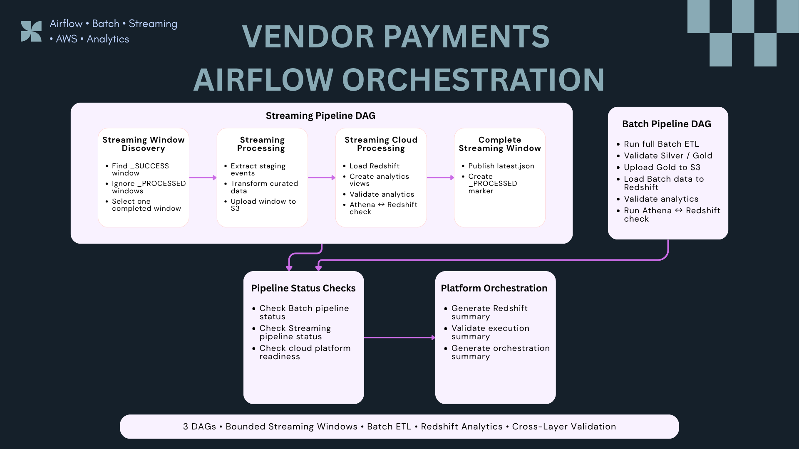
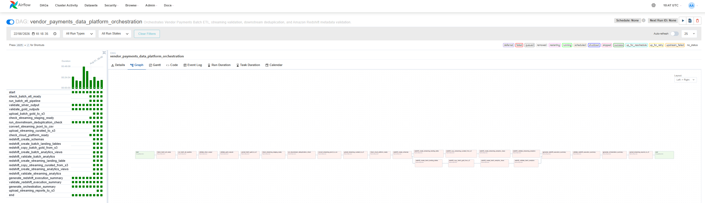
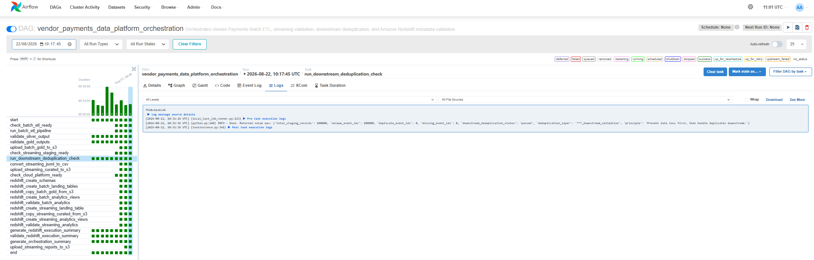
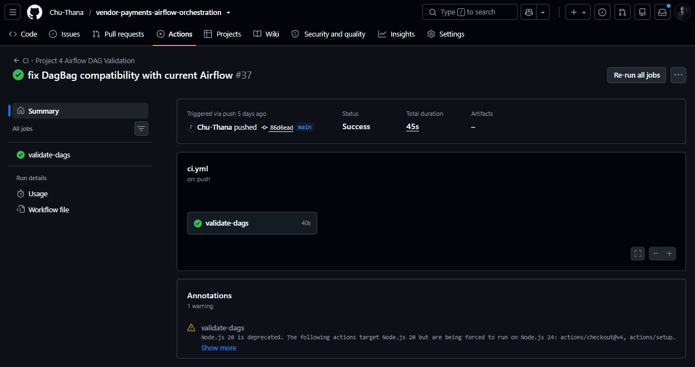
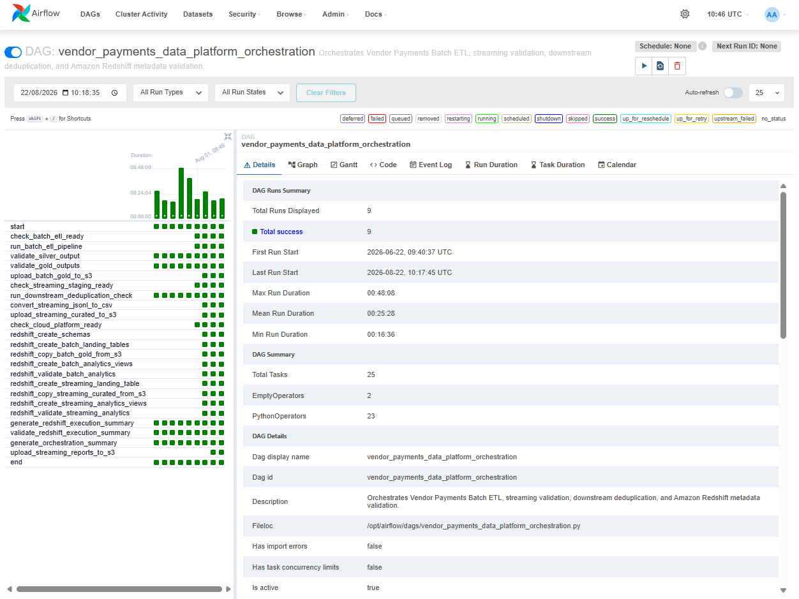
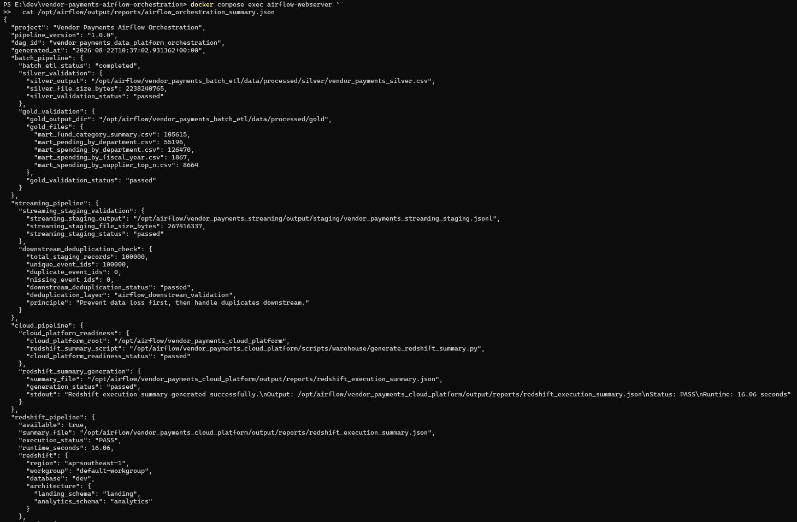
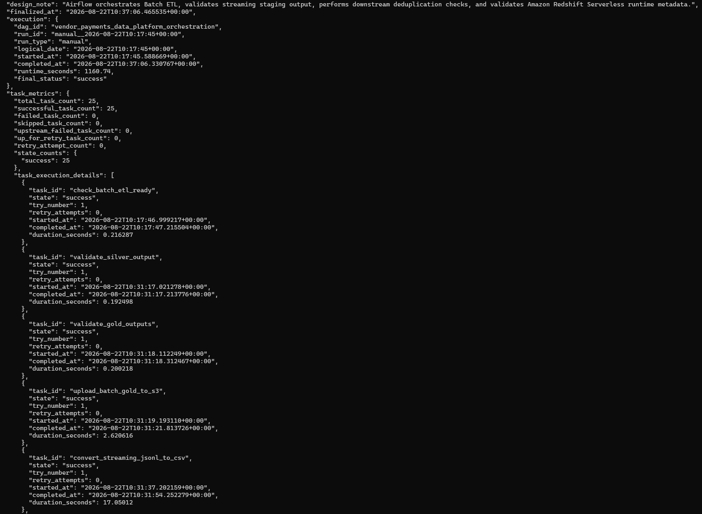

# 🛠 Vendor Payments Airflow Orchestration


Apache Airflow orchestration layer for the Vendor Payments data platform.

This project coordinates Batch ETL execution, validates Streaming staging data, publishes curated outputs to Amazon S3, orchestrates Amazon Redshift loading and analytics validation, and produces machine-readable execution summaries.

---

## 📌 Project Summary

The project demonstrates how Apache Airflow can coordinate a bounded data-platform workflow while keeping processing ownership clear across Batch, Streaming, Storage, and Warehouse components.

Airflow is responsible for:

- Running the existing Batch ETL pipeline
- Validating Silver and Gold outputs
- Uploading validated Batch Gold marts to Amazon S3
- Checking Streaming staging readiness
- Performing downstream event-ID validation
- Converting validated Streaming JSONL staging data into curated CSV
- Uploading curated Streaming output to Amazon S3
- Checking Cloud-platform readiness
- Creating Redshift schemas and landing structures
- Loading Batch and Streaming data from S3 into Redshift
- Creating Batch and Streaming analytics views
- Validating Redshift analytics relationships
- Generating and validating Redshift execution metadata
- Producing a cross-platform orchestration summary
- Uploading execution reports to S3
- Providing observable task execution through the Airflow UI
- Enforcing automated tests, Ruff linting, and GitHub Actions CI

The core design principle is:

```text
Airflow coordinates execution and validation.
Batch and Streaming components retain ownership of their upstream processing logic.
```

---

## 🧭 Architecture



The current orchestration flow spans five major responsibilities:

```text
Batch Processing
→ Streaming Staging Validation
→ Cloud Storage
→ Redshift Processing
→ Orchestration & Reporting
```

### Responsibility Boundaries

- **Batch Processing** — Runs the existing Batch ETL pipeline, validates Silver and five Gold marts, and publishes validated Gold outputs to S3.
- **Streaming Staging Validation** — Starts from the JSONL staging artifact already produced by the Kafka Consumer. Airflow checks readiness, validates event IDs, converts the bounded staging output to curated CSV, and publishes it to S3.
- **Cloud Storage** — Stores Batch Gold outputs, curated Streaming data, and execution reports used by downstream warehouse processing.
- **Redshift Processing** — Creates landing and analytics structures, loads Batch and Streaming data from S3, creates analytics views, and validates warehouse metrics.
- **Orchestration & Reporting** — Coordinates the 25-task workflow and generates machine-readable Redshift and Airflow execution summaries.

Airflow does **not** consume directly from Kafka. The Streaming repository owns Kafka ingestion and Redis first-level deduplication before the staging JSONL file reaches this orchestration layer.

---

## 📊 Project Metrics

The following metrics come from the latest successful controlled orchestration run.

| Metric | Result |
|---|---:|
| Main DAG tasks | 25 |
| Successful tasks | 25 |
| Failed tasks | 0 |
| Retry attempts | 0 |
| Successful DAG runtime | 1,160.74 seconds |
| Approximate DAG runtime | 19 minutes 20.74 seconds |
| Silver output size | 2,238,240,765 bytes |
| Gold marts validated | 5 |
| Streaming staging records validated | 100,000 |
| Unique streaming event IDs | 100,000 |
| Duplicate event IDs detected | 0 |
| Missing event IDs detected | 0 |
| Redshift Batch landing tables | 5 |
| Redshift Batch landing rows | 2,944 |
| Redshift Batch analytics views | 5 |
| Redshift Streaming landing tables | 1 |
| Redshift Streaming events | 100,000 |
| Redshift Streaming analytics views | 4 |
| Redshift validation | PASS |
| Orchestration validation | PASS |
| Automated tests | 17 passed |
| Ruff lint | Passed |
| GitHub Actions CI | Passed |

Values are derived from real execution artifacts rather than hard-coded DAG constants.

---

## ⚙️ DAG Overview

The repository contains three focused DAGs:

```text
vendor_payments_streaming_validation
vendor_payments_batch_etl_runner
vendor_payments_data_platform_orchestration
```


### Main DAG

```text
vendor_payments_data_platform_orchestration
```

DAG file:

```text
dags/vendor_payments_data_platform_orchestration.py
```

The main DAG runs manually with `schedule=None` and coordinates the complete bounded Batch, Streaming staging, S3, Redshift, validation, and reporting workflow.

### Batch Runner DAG

```text
vendor_payments_batch_etl_runner
```

DAG file:

```text
dags/vendor_payments_batch_etl_runner.py
```

This DAG provides a focused entry point for running and validating the Batch ETL workflow independently.

### Streaming Validation DAG

```text
vendor_payments_streaming_validation
```

DAG file:

```text
dags/vendor_payments_streaming_validation.py
```

This DAG validates the bounded Streaming staging output independently from the main cross-platform orchestration flow.

---

## 🔗 Main Task Flow

The current main DAG contains 25 tasks.

```text
start
→ check_batch_etl_ready
→ run_batch_etl_pipeline
→ validate_silver_output
→ validate_gold_outputs
→ upload_batch_gold_to_s3
→ check_streaming_staging_ready
→ run_downstream_deduplication_check
→ convert_streaming_jsonl_to_csv
→ upload_streaming_curated_to_s3
→ check_cloud_platform_ready
→ redshift_create_schemas
```

The Redshift stage branches into Batch and Streaming warehouse paths:

```text
Batch branch:
→ redshift_create_batch_landing_tables
→ redshift_copy_batch_gold_from_s3
→ redshift_create_batch_analytics_views
→ redshift_validate_batch_analytics

Streaming branch:
→ redshift_create_streaming_landing_table
→ redshift_copy_streaming_curated_from_s3
→ redshift_create_streaming_analytics_views
→ redshift_validate_streaming_analytics
```

```text
Both branches join:
→ generate_redshift_execution_summary
→ validate_redshift_execution_summary
→ generate_orchestration_summary
→ upload_streaming_reports_to_s3
→ end
```
Both branches must complete before the final Redshift execution summary is generated.



---

## 🧩 Task Responsibilities

### `check_batch_etl_ready`

Checks that the Batch ETL repository and pipeline entry point are available inside the Airflow container.

### `run_batch_etl_pipeline`

Runs the existing Batch ETL pipeline without duplicating transformation logic inside the DAG.

### `validate_silver_output`

Validates that the Batch Silver output exists and is non-empty.

### `validate_gold_outputs`

Validates the five analytics-ready Gold marts.

Latest validated row counts:

```text
mart_fund_category_summary.csv: 105,615
mart_pending_by_department.csv: 55,196
mart_spending_by_department.csv: 126,470
mart_spending_by_fiscal_year.csv: 1,867
mart_spending_by_supplier_top_n.csv: 8,664
```

### `upload_batch_gold_to_s3`

Publishes validated Batch Gold outputs to Amazon S3 for Redshift loading.

### `check_streaming_staging_ready`

Checks that the Kafka Consumer staging artifact exists and contains data.

```text
/opt/airflow/vendor_payments_streaming/output/staging/vendor_payments_streaming_staging.jsonl
```

The Streaming repository owns Kafka ingestion and Redis first-level deduplication before this file reaches Airflow.

### `run_downstream_deduplication_check`

Reads the bounded JSONL staging file and validates:

- Total staging records
- Unique event IDs
- Duplicate event IDs
- Missing event IDs

Latest controlled execution:

```text
total_staging_records = 100000
unique_event_ids = 100000
duplicate_event_ids = 0
missing_event_ids = 0
downstream_deduplication_status = passed
```

### `convert_streaming_jsonl_to_csv`

Converts the validated JSONL staging output into a curated CSV artifact suitable for downstream S3 and Redshift processing.

### `upload_streaming_curated_to_s3`

Uploads the curated Streaming CSV output to S3.

### `check_cloud_platform_ready`

Checks that the Cloud Data Platform repository and required Redshift integration resources are mounted and available.

### `redshift_create_schemas`

Creates or verifies the Redshift landing and analytics schemas required by the warehouse workflow.

### Batch Redshift Tasks

```text
redshift_create_batch_landing_tables
redshift_copy_batch_gold_from_s3
redshift_create_batch_analytics_views
redshift_validate_batch_analytics
```

### Streaming Redshift Tasks

```text
redshift_create_streaming_landing_table
redshift_copy_streaming_curated_from_s3
redshift_create_streaming_analytics_views
redshift_validate_streaming_analytics
```

### `generate_redshift_execution_summary`

Refreshes:

```text
/opt/airflow/vendor_payments_cloud_platform/output/reports/redshift_execution_summary.json
```

Latest result:

```text
Status: PASS
Runtime: 16.06 seconds
```

### `validate_redshift_execution_summary`

Validates the Redshift runtime artifact using relationship-based checks across both Batch and Streaming data.

### `generate_orchestration_summary`

Combines Batch, Streaming, Cloud, Redshift, validation, and Airflow execution metadata into:

```text
/opt/airflow/output/reports/airflow_orchestration_summary.json
```

### `upload_streaming_reports_to_s3`

Uploads final Streaming-related execution reports to S3 for persistent execution evidence.

---

## 🧾 Runtime Metadata

The orchestration summary is a machine-readable execution artifact that records:

```text
Project identity
DAG identity
Generated and finalized timestamps
Batch validation results
Streaming staging validation
Downstream deduplication metrics
Cloud-platform readiness
Redshift execution metadata
Overall orchestration status
Overall validation status
DAG runtime
Task state counts
Retry-attempt count
Per-task execution details
```

Latest top-level execution result:

```json
{
  "dag_id": "vendor_payments_data_platform_orchestration",
  "run_id": "manual__2026-08-22T10:17:45+00:00",
  "run_type": "manual",
  "runtime_seconds": 1160.74,
  "final_status": "success"
}
```

Latest task metrics:

```json
{
  "total_task_count": 25,
  "successful_task_count": 25,
  "failed_task_count": 0,
  "skipped_task_count": 0,
  "upstream_failed_task_count": 0,
  "up_for_retry_task_count": 0,
  "retry_attempt_count": 0,
  "state_counts": {
    "success": 25
  }
}
```

---

## 🔁 Downstream Deduplication

The Streaming pipeline applies first-level event-ID deduplication before writing staging data.

Airflow adds an independent downstream validation layer by reading the staged JSONL output and checking:

```text
Total records
Unique event IDs
Duplicate event IDs
Missing event IDs
```

This separation is intentional:

```text
Streaming layer
→ Kafka ingestion and Redis event-ID deduplication

Airflow layer
→ bounded staging validation and downstream execution evidence

Redshift layer
→ warehouse-level relationship validation
```



---

## ☁️ Amazon S3 Integration

Airflow publishes bounded outputs to S3 before Redshift loading.

```text
Batch Gold outputs
→ upload_batch_gold_to_s3

Validated Streaming staging
→ convert_streaming_jsonl_to_csv
→ upload_streaming_curated_to_s3

Final Streaming reports
→ upload_streaming_reports_to_s3
```

---

## 🏢 Amazon Redshift Processing & Validation

Validated Redshift metrics from the latest execution include:

```text
Batch:
5 landing tables
2,944 landing rows
5 analytics views
PASS validation

Streaming:
1 landing table
100,000 total rows
100,000 distinct event IDs
0 duplicate event IDs
0 missing event IDs
4 analytics views
PASS validation
```

Overall Redshift validation:

```text
PASS
```

---

## 🐳 Docker Integration

The external repositories are mounted into the Airflow containers:

```text
/opt/airflow/vendor_payments_batch_etl
/opt/airflow/vendor_payments_streaming
/opt/airflow/vendor_payments_cloud_platform
/opt/airflow/output
```

The AWS credentials directory is also mounted for AWS API authentication:

```text
/home/airflow/.aws
```

AWS integrations use IAM-based authentication through `boto3`; credentials are not hard-coded into the repository.

---

## ✅ Validation

Run tests inside the Airflow scheduler container:

```powershell
docker compose exec airflow-scheduler `
  python -m pytest /opt/airflow/tests -q
```

Run Ruff against the Airflow source directories:

```powershell
docker compose exec airflow-scheduler `
  python -m ruff check dags tests scripts
```

Current result:

```text
17 passed
All checks passed!
```


---

## ⚙️ Continuous Integration

GitHub Actions runs automatically on pushes and pull requests to `main`.

```text
Ruff
→ Pytest
```



Current CI result:

```text
validate-dags: Success
Total duration: 45 seconds
```

---

## 📸 Execution Evidence

### Successful 25-Task DAG Run

```text
DAG: vendor_payments_data_platform_orchestration
Run ID: manual__2026-08-22T10:17:45+00:00
Run type: manual
Status: success
Runtime: 1160.74 seconds
Tasks: 25 successful
Failed tasks: 0
Retry attempts: 0
```



### Airflow DAG Graph


### Orchestration Summary Evidence



### Airflow Execution Metadata



Validated execution result:

```text
total_task_count = 25
successful_task_count = 25
failed_task_count = 0
skipped_task_count = 0
upstream_failed_task_count = 0
up_for_retry_task_count = 0
retry_attempt_count = 0
final_status = success
validation.status = PASS
```

---

## 🗂️ Project Structure

```text
vendor-payments-airflow-orchestration/
│
├── .github/
│   └── workflows/
│       └── ci.yml
│
├── assets/
│   └── vendor-payments-orchestration/
│       └── final-orchestration/
│           ├── 00_airflow_architecture.png
│           ├── 01_airflow_dag_list.png
│           ├── 02_airflow_main_dag_success.png
│           ├── 03_airflow_main_task_graph.png
│           ├── 04_airflow_tests_and_lint.png
│           ├── 05_airflow_ci_success.png
│           ├── 06_airflow_downstream_dedup.png
│           ├── 07_airflow_orchestration_summary.png
│           └── 08_airflow_execution_metadata.png
│
├── dags/
│   ├── vendor_payments_batch_etl_runner.py
│   ├── vendor_payments_data_platform_orchestration.py
│   └── vendor_payments_streaming_validation.py
│
├── output/
│   └── reports/
│       └── airflow_orchestration_summary.json
│
├── scripts/
├── tests/
│   ├── test_airflow_execution_metadata.py
│   ├── test_dags.py
│   └── test_redshift_metadata.py
│
├── docker-compose.yml
├── Dockerfile
├── pytest.ini
├── requirements.txt
└── README.md
```

---

## ▶️ Run Locally

Start Airflow:

```powershell
docker compose up -d
```

Check services:

```powershell
docker compose ps
```

Open the Airflow UI:

```text
http://localhost:8080
```

Trigger the main DAG:

```powershell
docker compose exec airflow-scheduler `
  airflow dags trigger vendor_payments_data_platform_orchestration
```

Check DAG runs:

```powershell
docker compose exec airflow-scheduler `
  airflow dags list-runs `
  -d vendor_payments_data_platform_orchestration
```

Stop Airflow:

```powershell
docker compose down
```

---

## 🔗 Role in the Vendor Payments Data Platform

```text
Batch ETL Pipeline
→ produces Silver and Gold analytics outputs

Kafka Streaming Pipeline
→ consumes Kafka, applies Redis deduplication, and produces validated JSONL staging events

Airflow Orchestration
→ coordinates Batch execution, validates Streaming staging, publishes data to S3, orchestrates Redshift processing, and generates runtime metadata

Cloud Data Platform
→ provides AWS configuration, S3/Redshift integration resources, and Redshift execution metadata

API Serving Layer
→ exposes trusted Batch and Streaming analytics to downstream consumers
```

This project is the coordination and execution-control layer across the platform. It does not replace the upstream transformation and Kafka ingestion logic owned by the Batch and Streaming repositories.

---

## 🧠 Key Engineering Decisions

### Why keep Batch transformation logic outside the DAG?

The Batch ETL repository remains the owner of raw-to-Silver-to-Gold transformation logic. Airflow invokes the pipeline and validates its outputs rather than duplicating business transformations inside orchestration code.

### Why does Airflow start from Streaming staging instead of Kafka?

Kafka ingestion is continuous in nature, while the current Airflow portfolio workflow is intentionally bounded and reproducible.

The Kafka Consumer therefore owns ingestion and first-level Redis deduplication. Airflow begins when a deterministic staging JSONL artifact is available for downstream validation.

### Why convert Streaming JSONL to CSV?

The staging JSONL preserves the output format produced by the Streaming consumer.

Airflow converts the validated bounded output into curated CSV for the current S3 and Redshift loading path without changing ownership of Kafka ingestion.

### Why keep two deduplication layers?

Redis protects the ingestion layer from repeated event IDs.

Airflow independently validates the staged output before downstream cloud processing, while Redshift performs warehouse-level relationship validation.

### Why orchestrate S3 and Redshift tasks explicitly?

Explicit S3 and Redshift tasks make cross-platform dependencies observable and testable.

### Why generate separate Redshift and Airflow summaries?

The Redshift summary describes warehouse state.

The Airflow summary describes orchestration state and incorporates Batch, Streaming, Cloud, Redshift, and task-execution evidence.

### Why use relationship-based validation?

The DAG validates measurable relationships such as:

```text
100,000 Streaming rows
=
100,000 distinct event IDs

Duplicate event IDs
=
0

Missing event IDs
=
0
```

---

## 🛣️ Planned Development

The current portfolio version is intentionally bounded and manually triggered. Possible production-oriented extensions include:

- Scheduled or event-driven production execution
- Centralized observability and log aggregation
- Consumer-lag or staging-window awareness before downstream processing
- Dynamic discovery of immutable Streaming staging outputs
- Stronger execution-history persistence and alerting
- Additional data-quality gates before warehouse publishing

---

## 🎯 Key Takeaway

This project demonstrates more than creating an Airflow DAG.

It shows how to coordinate a bounded cross-platform workflow across Batch ETL, Streaming staging, Amazon S3, and Amazon Redshift; preserve ownership boundaries; validate data relationships at multiple stages; and turn a successful 25-task DAG run into measurable, testable, and portfolio-ready execution evidence.

```text
Batch ETL
→ Validated Silver / Gold
→ S3

Streaming Staging JSONL
→ Downstream Validation
→ Curated CSV
→ S3

S3
→ Redshift Landing
→ Analytics Views
→ Warehouse Validation

Airflow
→ Execution Coordination
→ Runtime Metadata
→ Final Orchestration Summary
```
