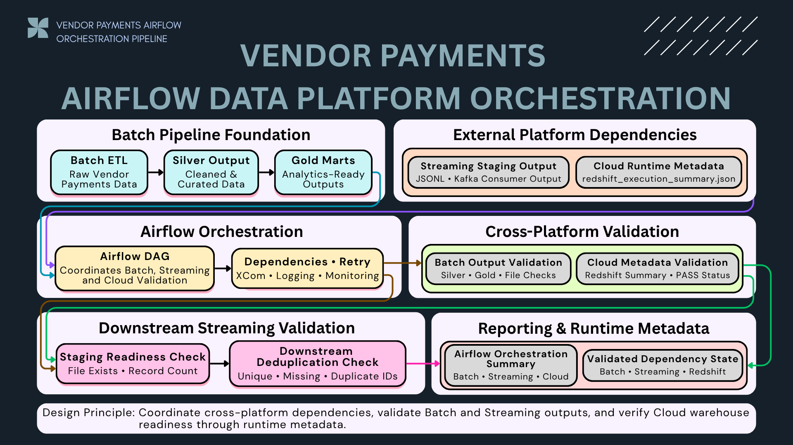
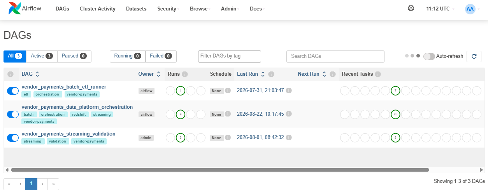
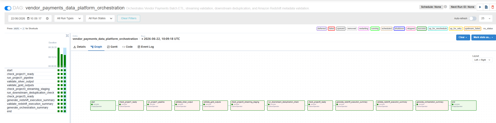
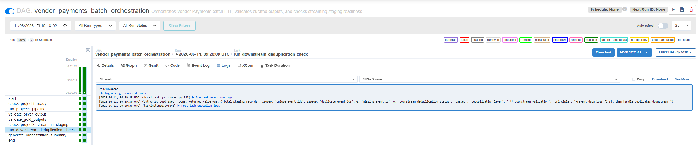
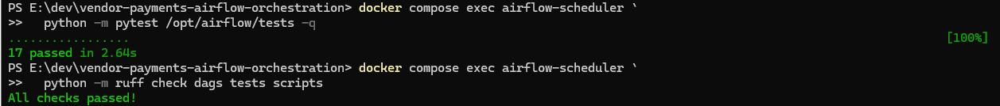
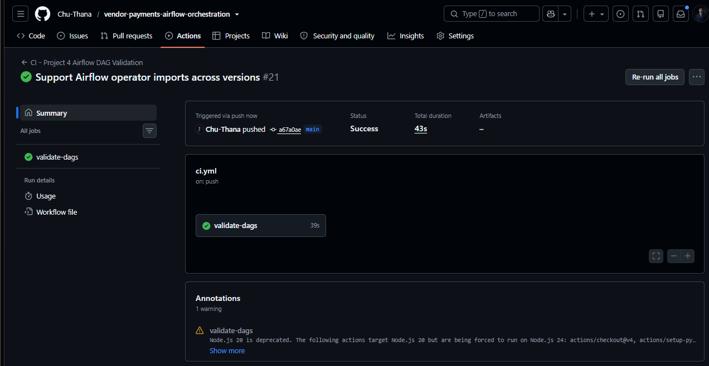
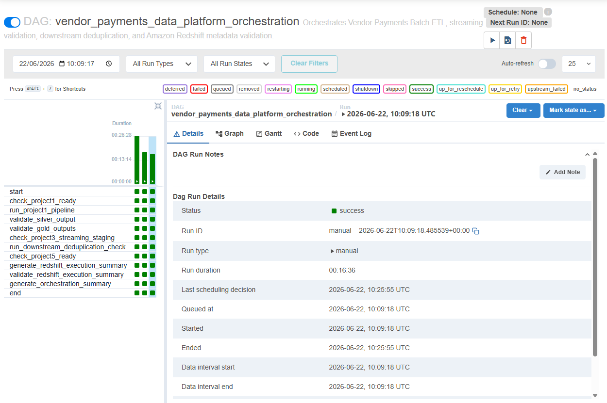
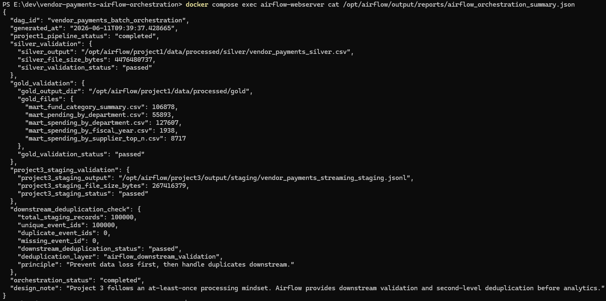
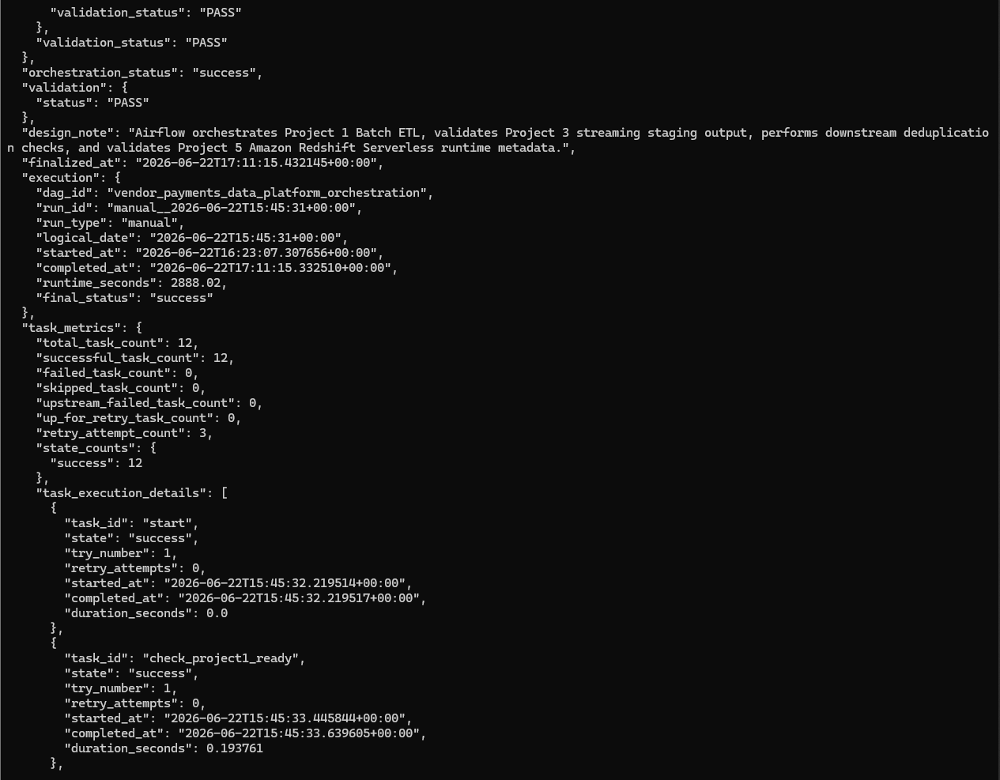

# 🛠 Vendor Payments Airflow Orchestration


Apache Airflow orchestration layer for the Vendor Payments data platform.

This project coordinates Batch ETL execution, validates Streaming staging data, performs downstream deduplication checks, verifies Amazon Redshift runtime metadata, and produces a machine-readable orchestration summary.

---

## 📌 Project Summary

The project demonstrates how Apache Airflow can coordinate multiple data-platform dependencies without duplicating the processing logic owned by the underlying systems.

Airflow is responsible for:

- Running the existing Batch ETL pipeline
- Validating Silver and Gold outputs
- Checking Streaming staging readiness
- Performing downstream event-ID validation
- Checking Cloud-platform readiness
- Generating and validating Amazon Redshift execution metadata
- Producing a cross-project orchestration summary
- Providing observable task execution through the Airflow UI
- Enforcing automated tests, linting, and GitHub Actions CI

The core design principle is:

```text
Airflow orchestrates and validates.
Batch, Streaming, and Cloud components retain ownership of their processing logic.
```

---

## 🧭 Architecture



The orchestration flow connects three independent platform dependencies:

- **Batch Pipeline Foundation** — produces trusted Silver and Gold outputs
- **Streaming Staging Output** — provides JSONL events from the Kafka consumer pipeline
- **Cloud Runtime Metadata** — provides Redshift execution evidence through `redshift_execution_summary.json`

Airflow coordinates these dependencies, validates their outputs, and consolidates the results into a single orchestration report.

### Responsibility Boundaries

- **Batch pipeline** owns transformation from raw source data into Silver and Gold outputs.
- **Streaming pipeline** owns Kafka ingestion, Redis event-ID deduplication, and JSONL staging output.
- **Cloud platform** owns S3, Athena, Redshift landing tables, analytics views, and Redshift runtime metadata.
- **Airflow orchestration** owns dependency coordination, execution order, downstream validation, and summary reporting.

---

## 📊 Project Metrics

| Metric | Result |
|---|---:|
| Main DAG tasks | 12 |
| Successful DAG runtime | 16 minutes 36 seconds |
| Silver output size | 2,238,240,765 bytes |
| Gold marts validated | 5 |
| Streaming staging records validated | 100,000 |
| Unique streaming event IDs | 100,000 |
| Duplicate event IDs detected | 0 |
| Missing event IDs detected | 0 |
| Redshift Batch landing tables | 5 |
| Redshift Batch landing rows | 2,944 |
| Redshift Batch analytics views | 5 |
| Redshift Streaming landing tables | 1 |
| Redshift Streaming events | 100,000 |
| Redshift Streaming analytics views | 4 |
| Automated tests | 17 passed |
| Ruff lint | Passed |
| GitHub Actions CI | Passed |

Values are derived from real execution artifacts rather than being hard-coded into the DAG.

---

## ⚙️ DAG Overview

The repository contains three focused DAGs:

```text
vendor_payments_streaming_validation
vendor_payments_batch_etl_runner
vendor_payments_data_platform_orchestration
```



### Main DAG

```text
vendor_payments_data_platform_orchestration
```

DAG file:

```text
dags/vendor_payments_data_platform_orchestration.py
```

The main DAG runs manually with `schedule=None` and coordinates Batch, Streaming, Cloud-readiness, Redshift metadata, and reporting tasks.

### Streaming Validation DAG

```text
vendor_payments_streaming_validation
```

DAG file:

```text
dags/vendor_payments_streaming_validation.py
```

This DAG validates the Kafka Consumer staging output through Extract, Transform, secondary deduplication, warehouse-ready summary generation, S3 upload, and Telegram callbacks.

---

## 🔗 Main Task Flow

```text
start
→ check_project1_ready
→ run_project1_pipeline
→ validate_silver_output
→ validate_gold_outputs
→ check_project3_streaming_staging
→ run_downstream_deduplication_check
→ check_project5_ready
→ generate_redshift_execution_summary
→ validate_redshift_execution_summary
→ generate_orchestration_summary
→ end
```



The DAG intentionally keeps task dependencies explicit. This makes the execution order easy to inspect, test, and explain.

---

## 🧩 Task Responsibilities

### `check_project1_ready`

Checks that the Batch ETL repository and pipeline entry point are available inside the Airflow container.

```text
/opt/airflow/project1
/opt/airflow/project1/scripts/pipeline/run_pipeline.py
```

### `run_project1_pipeline`

Runs the external Batch ETL pipeline without duplicating its processing logic inside the DAG.

```text
python -m scripts.pipeline.run_pipeline
```

### `validate_silver_output`

Validates that the Silver output exists and is not empty.

```text
/opt/airflow/project1/data/processed/silver/vendor_payments_silver.csv
```

### `validate_gold_outputs`

Validates the five analytics-ready Gold marts:

```text
mart_fund_category_summary.csv
mart_pending_by_department.csv
mart_spending_by_department.csv
mart_spending_by_fiscal_year.csv
mart_spending_by_supplier_top_n.csv
```

### `check_project3_streaming_staging`

Checks that the Kafka Streaming staging artifact exists and contains data.

```text
/opt/airflow/project3/output/staging/vendor_payments_streaming_staging.jsonl
```

### `run_downstream_deduplication_check`

Reads the JSONL staging file and validates:

- Total staging records
- Unique event IDs
- Duplicate event IDs
- Missing event IDs

Controlled execution result:

```text
total_staging_records = 100000
unique_event_ids = 100000
duplicate_event_ids = 0
missing_event_ids = 0
downstream_deduplication_status = passed
```

### `check_project5_ready`

Checks that the Cloud Data Platform repository and Redshift metadata generator are mounted and available.

```text
/opt/airflow/project5
/opt/airflow/project5/scripts/warehouse/generate_redshift_summary.py
```

### `generate_redshift_execution_summary`

Runs the Cloud-platform metadata generator through the Redshift Data API.

```text
python /opt/airflow/project5/scripts/warehouse/generate_redshift_summary.py
```

This task queries the existing Redshift Serverless environment and refreshes:

```text
/opt/airflow/project5/output/reports/redshift_execution_summary.json
```

It does not duplicate Redshift table-creation or warehouse-loading logic inside the Airflow DAG.

### `validate_redshift_execution_summary`

Validates the Redshift runtime artifact using relationship-based checks:

- Execution status is `PASS`
- Batch validation status is `PASS`
- Streaming validation status is `PASS`
- Five Batch landing tables exist
- Five Batch analytics views exist
- Four Streaming analytics views exist
- Streaming rows are greater than zero
- Distinct event IDs equal total rows
- Duplicate event IDs equal zero
- Missing event IDs equal zero
- Analytics event totals match landing totals

### `generate_orchestration_summary`

Combines Batch, Streaming, Cloud-readiness, and Redshift validation results into:

```text
/opt/airflow/output/reports/airflow_orchestration_summary.json
```

---

## 🧾 Runtime Metadata

The orchestration summary is a machine-readable execution artifact that records:

```text
Project identity
DAG identity
Generated timestamp
Batch validation results
Streaming staging validation
Downstream deduplication metrics
Cloud-platform readiness
Redshift execution metadata
Overall orchestration status
Overall validation status
```

Example top-level structure:

```json
{
  "project": "Vendor Payments Airflow Orchestration",
  "pipeline_version": "1.0.0",
  "dag_id": "vendor_payments_data_platform_orchestration",
  "generated_at": "2026-06-22T10:25:53.665269+00:00",
  "finalized_at": "2026-06-22T17:11:15.432145+00:00",
  "batch_pipeline": {},
  "streaming_pipeline": {},
  "cloud_pipeline": {},
  "redshift_pipeline": {},
  "orchestration_status": "success",
  "validation": {
    "status": "PASS"
  },
  "execution": {
    "run_id": "manual__2026-06-22T15:45:31+00:00",
    "run_type": "manual",
    "runtime_seconds": 2888.02,
    "final_status": "success"
  },
  "task_metrics": {
    "total_task_count": 12,
    "successful_task_count": 12,
    "failed_task_count": 0,
    "retry_attempt_count": 3,
    "state_counts": {
      "success": 12
    },
    "task_execution_details": []
  }
}
```

The metadata uses real XCom values and external execution artifacts rather than fixed values embedded in the DAG.

---

## 🔁 Downstream Deduplication

The Streaming pipeline applies first-level event-ID deduplication before writing staging data.

Airflow adds an independent downstream validation layer by reading the staged JSONL output and checking:

```text
Total records
Unique event IDs
Duplicate event IDs
Missing event IDs
```

This separation is intentional:

```text
Streaming layer
→ ingestion-time deduplication

Airflow layer
→ downstream validation and execution evidence

Redshift layer
→ warehouse-level curated validation
```

Duplicate metrics from these layers are not merged automatically because they represent different validation stages.



---

## ☁️ Amazon Redshift Metadata Validation

The Cloud Data Platform remains a separate project and owns the Redshift implementation.

Airflow integrates with it by:

```text
Checking the mounted Cloud repository
→ Running the metadata generator
→ Reading redshift_execution_summary.json
→ Validating Batch and Streaming warehouse metrics
→ Adding the result to the Airflow orchestration summary
```

Validated Redshift execution metrics include:

```text
5 Batch landing tables
2,944 Batch landing rows
5 Batch analytics views
1 Streaming landing table
100,000 Streaming events
100,000 distinct event IDs
0 duplicate event IDs
0 missing event IDs
4 Streaming analytics views
PASS validation status
```

This approach keeps the architecture modular: Airflow coordinates and validates, while the Cloud platform owns warehouse processing.

---

## 🐳 Docker Integration

The external repositories are mounted into the Airflow containers:

```text
/opt/airflow/project1
/opt/airflow/project3
/opt/airflow/project5
/opt/airflow/output
```

The AWS credentials directory is also mounted for Redshift Data API authentication:

```text
/home/airflow/.aws
```

The Redshift integration uses IAM-based authentication through `boto3`; no Redshift username or password is stored in the repository.

---

## ✅ Validation

Run the Project 4 tests inside the Airflow container:

```powershell
docker compose exec airflow-scheduler `
  python -m pytest /opt/airflow/tests -q
```

Run Ruff against Project 4 source directories only:

```powershell
docker compose exec airflow-scheduler `
  python -m ruff check dags tests scripts
```

Current result:

```text
17 passed
All checks passed!
```



### Test Coverage

The automated tests validate:

- DAG folder availability
- Airflow DAG import integrity
- Main DAG ID
- Exact 12-task structure
- Full dependency order
- DAG tags and configuration
- Redshift task dependency order
- Valid Redshift metadata
- Duplicate-event detection
- Missing-event detection
- Incorrect analytics-view detection
- Missing Redshift summary file handling
- DAG execution metadata generation
- Task-state aggregation
- Retry-attempt counting
- DAG runtime calculation
- Final orchestration-summary metadata updates

The unit tests use temporary JSON fixtures and monkeypatching, so CI does not connect to AWS or Redshift.

---

## ⚙️ Continuous Integration

GitHub Actions runs automatically on pushes and pull requests to `main`.

```text
Ruff
→ Pytest
```

The CI workflow validates only the Project 4 directories:

```text
dags/
tests/
scripts/
```



Current CI result:

```text
validate-dags: Success
Total duration: 43 seconds
```

---

## 📸 Execution Evidence

### Successful 12-Task DAG Run

The final controlled run completed successfully with all tasks passing.

```text
DAG: vendor_payments_data_platform_orchestration
Run type: manual
Status: success
Runtime: 00:16:36
Tasks: 12 successful
```



### Airflow DAG Graph

The graph view shows the complete dependency chain from Batch execution through Streaming validation, Redshift metadata validation, and orchestration reporting.


### Orchestration Summary Evidence



### Airflow Execution Metadata



The orchestration summary includes Airflow-native execution metadata for the completed DAG run.

Captured metadata includes:

* DAG run ID and run type
* Logical, start, completion, and finalization timestamps
* Total DAG runtime
* Final DAG status
* Successful, failed, skipped, and upstream-failed task counts
* Retry-attempt count
* Per-task state, timestamps, duration, and retry details

Validated execution result:

```text
total_task_count = 12
successful_task_count = 12
failed_task_count = 0
skipped_task_count = 0
upstream_failed_task_count = 0
final_status = success
validation.status = PASS
```

The recorded retry count reflects the actual recovery history of the validated DAG run.

---

## 🗂️ Project Structure

```text
vendor-payments-airflow-orchestration/
│
├── .github/
│   └── workflows/
│       └── ci.yml
│
├── assets/
│   └── vendor-payments-orchestration/
│       ├── batch-foundation/
│       ├── final-orchestration/
│       └── legacy/
│
├── dags/
│   ├── vendor_payments_batch_etl_runner.py
│   ├── vendor_payments_data_platform_orchestration.py
│   └── vendor_payments_streaming_validation.py
│
├── output/
│   └── reports/
│       └── airflow_orchestration_summary.json
│
├── scripts/
├── tests/
│   ├── test_airflow_execution_metadata.py
│   ├── test_dags.py
│   └── test_redshift_metadata.py
│
├── docker-compose.yml
├── Dockerfile
├── pytest.ini
├── requirements.txt
└── README.md
```

---

## ▶️ Run Locally

Start Airflow:

```powershell
docker compose up -d
```

Check services:

```powershell
docker compose ps
```

Open the Airflow UI:

```text
http://localhost:8080
```

Trigger the main DAG:

```powershell
docker compose exec airflow-scheduler `
  airflow dags trigger vendor_payments_data_platform_orchestration
```

Check DAG runs:

```powershell
docker compose exec airflow-scheduler `
  airflow dags list-runs `
  -d vendor_payments_data_platform_orchestration
```

Stop Airflow:

```powershell
docker compose down
```

---

## 🔗 Role in the Vendor Payments Data Platform

```text
Batch ETL Pipeline
→ produces Silver and Gold analytics outputs

Kafka Streaming Pipeline
→ produces validated JSONL staging events

Airflow Orchestration
→ coordinates execution, validates dependencies, and generates runtime metadata

Cloud Data Platform
→ owns S3, Athena, Redshift, and warehouse-level validation

API Serving Layer
→ exposes trusted Batch and Streaming analytics to downstream consumers
```

This project is the coordination and validation layer across the platform. It does not replace the processing logic owned by the Batch, Streaming, Cloud, or API projects.

---

## 🧠 Key Engineering Decisions

- Keep orchestration logic separate from transformation logic
- Use external scripts rather than embedding ETL or warehouse SQL in DAG files
- Validate measurable runtime relationships instead of hard-coding row counts
- Keep Streaming deduplication metrics separate by processing layer
- Use XCom for task-level results and JSON for durable execution evidence
- Use IAM and the Redshift Data API instead of repository-stored credentials
- Make DAG structure and dependency order testable in CI
- Support multiple Airflow operator import paths for local and CI compatibility

---

## 🛣️ Planned Development

- Add Cloud upload and Athena readiness metadata where useful
- Add centralized observability and log aggregation
- Add scheduled production execution after deployment

---

## 🎯 Key Takeaway

This project demonstrates more than creating an Airflow DAG.

It shows how to coordinate independent Batch, Streaming, and Cloud components; validate their outputs and runtime artifacts; preserve clear ownership boundaries; and turn a successful DAG run into measurable, testable, and portfolio-ready execution evidence.
